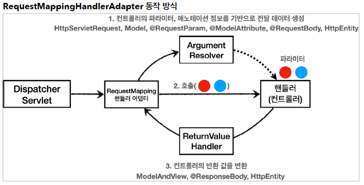
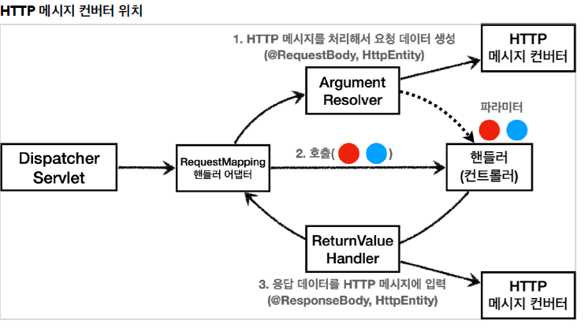

# Spring MVC 학습
- 출처: 인프런 김영한님 강의 '스프링 MVC 1편 - 백엔드 웹 개발 핵심 기술' 
- https://www.inflearn.com/course/%EC%8A%A4%ED%94%84%EB%A7%81-mvc-1/questions?s=index.html&page=1&type=question
- Spring MVC의 구조를 이해하고 어떤 기능이 있는지 살펴본다.

## 학습 목차

- [로깅](#로깅)
- [요청 맵핑](#요청-맵핑)
- [응답 맵핑](#응답-맵핑)
- [HTTP 메시지 컨버터](#HTTP-메시지-컨버터)
- [요청 매핑 핸들러 어댑터](#요청-매핑-핸들러-어댑터)
---
## 로깅
 - 로깅 라이브러리
    - 스프링 부트 라이브러리를 사용하면 스프링 부트 로깅 라이브러리(spring-boot-start-logging)가 함께 포함된다.
    - 로깅 라이브러리는 인터페이스로 SLF4J가 있고 사용할 구현체는 Logback이다.

 - 로그 호출
    - 변수 선언
      ```
      private Logger log = LoggerFactory.getLogger(getClass());
      private static final Logger log = LoggerFactory.getLogger(Xxx.class)
      ```
    - 이것을 자동으로 선언하려면 롬복 어노테이션 '@Slf4j'를 사용하면 된다.
    
 - 로그 레벨
    - TRACE > DEBUG > INFO > WARN > ERROR
    - 개발 서버는 debug를 출력하는 것이, 운영서버는 info를 출력하는 것이 보편적이다.
    
 - 올바른 로그 사용법
    ```
    1. log.debug("data="+data)
    2. log.debug("data={}", data)
    ```
   - '1'은 문자 더하기 연산이 일어나서 불필요한 연산이 일어나게 된다.
   
   - 사실 로그를 호출하는 함수는 (String format, Object org)2개의 파라미터로 구성되어 있고 해당 로그가 출력 가능한 레벨이여야 로그가 출력된다.
 
 - 로그 사용시 장점
    
    - 로그 레벨에 따라 출력하고 싶은 로그를 출력 시킬 수 있다.
    - 콘솔 뿐만 아니라 파일이나 네트워크 등 로그를 별도 위치에 남길 수 있다.
    - 파일로 남길 때는 일별, 특정 용량에 따라 로그를 분할 하는 것이 가능하다.
    - 성능이 System.out 보다 좋다.
---
## 요청 맵핑
 ### 어노테이션 기반 요청 메시지 처리
 - 스프링 컨테이너는 @Controller의 클래스를 찾아 스프링 빈에 등록하고 @RequestMapping 어노테이션을 찾아 해당 url을 WAS에 저장시킴으로써 처리할 준비를 마친다.
 - 기본적으로 DispatcherServlet 클래스를 사용하여 클라이언트와 HTTP 통신을 하게 된다.
 ### 요청 어노테이션
 - @RequestMapping
     ```
        1. @RequestMapping("/mapping-get-v1")
        2. @RequestMapping(value = "/mapping-get-v1", method = RequestMethod.GET)
     ```
   - '1.'과 같이 url 경로만 지정해주거나 '2.'와 같이 HTTP 메서드 타입을 지정할 수 있다.
   - 메서드 타입을 지정하면 해당 url의 다른 메서드 타입의 요청이 들어오면 405 Method Not Allowed 에러를 반환한다.
 - HTTP 메서드 축약
    ```
     @GetMapping
     @PostMapping
     @PutMapping
     @DeleteMapping
     @PatchMapping
    ```
   - @RequstMapping에서 특정 메서드 타입을 지정하는 것 보다 축약된 메서드를 사용하는 것이 직관적이다.
   
 - 경로 변수 사용
      ```
        1.
        @GetMapping("/mapping/{userId}")
        public String mappingPath(@PathVariable String userId, @PathVariable LongorderId)
        
        2.
        @GetMapping("/mapping/users/{userId}/orders/{orderId}")
        public String mappingPath(@PathVariable String userId, @PathVariable Long orderId)
      ```
   - url 경로에 {xxx}를 변수로서 지정하고 함수 파라미터로써 해당 경로변수를 매핑 할수 있다.
   
   - '2.' 와 같이 다중 경로 변수 사용도 가능하다.
 
 - 미디어 타입 조건 매핑
    - HTTP 요청 (Content-Type, consume), (Accept, produce)
        ```
        1. @PostMapping(value = "/mapping-consume", consumes = "application/json")
        2. @PostMapping(value = "/mapping-produce", produces = "text/html")
        ```
    - '1.'은 HTTP 요청의 Content-Type 헤더를 기반으로 미디어 타입으로 매핑한다.
   
    - '2.'는 HTTP 요청의 Accept 헤더를 기반으로 미디어 타입으로 매핑한다.
   
    - 만약 조건에 맞지 않으면 각각 415 Unsupported Media Type, 406 Not Acceptable 오류를 반환한다.
    
 ### HTTP 요청 데이터 전달 방식
 - 클라이언트에서 서버로 요청 데이터를 전달할 떄는 주로 3가지 방법을 사용한다.
 
 - GET-쿼리 파라미터
    - /url?username=hello&age=20
    - 메시지 바디 없이, URL의 쿼리 파라미터에 데이터를 포함해서 전달
 - POST-HTML Form
    - content-type: application/x-www-form-urlencoded
    - 메시지 바디에 쿼리 파리미터 형식으로 전달 username=hello&age=20
 - HTTP message body에 데이터를 직접 담아서 요청
    - HTTP API에서 주로 사용, JSON, XML, TEXT
    - 데이터 형식은 주로 JSON 사용
 #### 쿼리 파라미터, HTML Form
 - GET 쿼리 파리미터 전송 방식이든, POST HTML Form 전송 방식이든 둘다 형식이 같으므로 구분없이조회할 수 있다.
 
 - 이것을 간단히 요청 파라미터(request parameter) 조회라 한다.
    ```
    1.
    @RequestMapping("/request-param-v2")
    public String requestParamV2(@RequestParam("username") String memberName, @RequestParam("age") int memberAge)
    
    2.
    @RequestMapping("/request-param-v3")
    public String requestParamV3(@RequestParam String username, @RequestParam int age)
    
    3.
    @RequestMapping("/request-param-v4")
    public String requestParamV4(String username, int age)
    
    4.
    @RequestMapping("/request-param-required")
    public String requestParamRequired(@RequestParam(required = true) String username, @RequestParam(required = false) Integer age)
    
    5.
    @RequestMapping("/request-param-default")
    public String requestParamDefault(@RequestParam(required = true, defaultValue = "guest") String username, @RequestParam(required = false, defaultValue = "-1") int age)
    
    6.
    @RequestMapping("/request-param-map")
    public String requestParamMap(@RequestParam Map<String, Object> paramMap) 
    ```
    - '1.'과 같이 @RequestParam("xxx") 파라미터 이름을 옆에 선언한 변수에 맵핑 할 수 있다.
    
    - '2.'와 같이 파라미터 이름과 맵핑할 변수의 이름이 같으면 파라미터를 생략할 수 있다.
    
    - 방금 조건을 만족하면 '3.'과 같이 어노테이션 또한 생략할 수 있다.
    
    - '4.'와 같이 특정 파라미터를 반드시 포함하거나 아닌 조건을 만들 수 있다.
    
    - '5.'와 같이 특정 파라미터의 기본 값을 정할 수 있다.
    
    - '6.'과 같이 파라미터를 맵으로써 받을 수 있다. key값으로는 파라미터 Object는 매핑된 데이터가 된다.
 #### @ModelAttribute
 - 스프링 부트는 요청 파라미터를 매핑하고 객체와 바인딩을 자동으로 해주는 기능을 제공한다.
     ```
     1.
     @RequestMapping("/model-attribute-v1")
     public String modelAttributeV1(@ModelAttribute HelloData helloData)
     
     2.
     @RequestMapping("/model-attribute-v2")
     public String modelAttributeV2(HelloData helloData)
     ```
     - 스프링MVC는 @ModelAttribute가 있으면 바인딩할 객체(HelloData)를 생성하고 요청 파라미터의 이름으로 객체의 프로퍼티에 맞게 setter를 호출하여 바인딩(입력) 시킨다.
     
     - 어노테이션은 생략할 수 있다. 하지만 @RequestParam도 위에서 생략할 수 있다고 했다. 따라서 다음과 같은 규칙이 적용된다.
     
     - String , int , Integer 같은 단순 타입 = @RequestParam
     
     - 나머지 = @ModelAttribute (argument resolver 로 지정해둔 타입 외)
 
 #### 단순 텍스트
 - HTTP message body에 데이터를 직접 담아서 요청
 - 요청 파라미터와 다르게, HTTP 메시지 바디를 통해 데이터가 직접 데이터가 넘어오는 경우는 @RequestParam , @ModelAttribute 를 사용할 수 없다.
 
     ```
     1.
     @PostMapping("/request-body-string-v2")
     public void requestBodyStringV2(InputStream inputStream, Writer responseWriter) throws IOException {
     String messageBody = StreamUtils.copyToString(inputStream, StandardCharsets.UTF_8);
     }
        
     2.
     @PostMapping("/request-body-string-v3")
     public HttpEntity<String> requestBodyStringV3(HttpEntity<String> httpEntity){
     String messageBody = httpEntity.getBody();
     }
    
     3.
     @PostMapping("/request-body-string-v4")
     public String requestBodyStringV4(@RequestBody String messageBody)
     ```
    - '1.'과 같이 InputStream(Reader)를 통해 HTTP message body의 내용을 직접 조회할 수 있다.
    
    - '2.'와 같이 스프링MVC는 HttpEntity라는 파라미터를 지원하는데, message body뿐만 아니라 추가로 다른 정보도 조회할 수 있다. 이것은 요청, 응답 둘다 사용할 수 있다.
    
    - '3.'과 같이 @RequestBody 어노테이션을 사용하면 자동으로 변수에 message body의 내용을 매핑한다. 위에 두개의 파라미터와 달리 매우 편리하다.
    
    - 하지만 헤더 정보가 필요하다면 HttpEntity를 사용해야 한다.
#### JSON
 - JSON 형식도 단순 텍스트와 맵핑 방식이 비슷하다.
   ```
    1.
    @PostMapping("/request-body-json-v2")
    public String requestBodyJsonV2(@RequestBody String messageBody)
    2.
    @PostMapping("/request-body-json-v3")
    public String requestBodyJsonV3(@RequestBody HelloData data)
    3.
    @PostMapping("/request-body-json-v4")
    public String requestBodyJsonV4(HttpEntity<HelloData> httpEntity)
   ```
   - @RequestBody 변수에 String으로 맵핑하고 객체로 변환하려면 ObjectMapper를 통해 변환시킨다.
   - 또는 자동으로 객체로 매핑하거나 HttpEntity 의 getBody로 객체에 데이터를 주입할 수 있다. 
 
 ---
 ## 응답 맵핑
  ### HTTP 응답 데이터 생성 방식
  - 정적 리소스
     
     - 예) 웹 브라우저에 정적인 HTML, css, js
  
  - 뷰 템플릿
       
     - 예) 웹 브라우저에 동적인 HTML을 제공할 때
  
  - HTTP 메시지
       
     - 예) API 호출
             
  #### 정적 리소스
   - 스프링 부트는 클래스패스의 다음 디렉토리에 있는 정적 리소스를 제공한다.
   
        - /static , /public , /resources , /META-INF/resources
        
   - 웹 브라우저의 요청이 "http://localhost:8080/basic/hello-form.html" 디렉토리의 해당 파일을 반환한다.
   
 #### 뷰 템플릿
  - 뷰 템플릿을 거쳐서 HTML이 생성되고, 뷰가 응답을 만들어서 전달한다.
  
  - 일반적으로 HTML을 동적으로 생성하는 용도로 사용하지만, 다른 것들도 가능하다. 뷰 템플릿이 만들 수 있는 것이라면 뭐든지 가능하다.
  
      ```
      1.
      @RequestMapping("/response-view-v1")
      public ModelAndView responseViewV1() {
            ModelAndView mav = new ModelAndView("response/hello").addObject("data", "hello!");
            
            return mav;
      }
       
      2.
      @RequestMapping("/response-view-v2")
      public String responseViewV2(Model model) {
                model.addAttribute("data", "hello!!");
                return "response/hello";
      }
      ```
    - '1.'과 같이 스프링이 지원하는 ModelAndView로 뷰에다 모델 객체 데이터를 넣는 작업을 하고 반환하면 뷰에 데이터가 삽입되어 뷰가 반환된다.
    - '2.'와 같이 매핑 변수를 파라미터에 넣고 모델에 데이터를 넣어 뷰 템플릿의 경로를 반환하면 결과는 동일하다. 
    - 만약 뷰를 반환하는 것이아니라 String을 반환하고 싶으면 메서드에 @ResponseBody나 클래스 상단의 @RestController를 사용하게 되면 View Resolver를 통해
    뷰를 반환하는것이 아니라 해당 String 값을 화면에 그대로 입력하여 반환한다.
    
  #### HTTP API, 메시지 바디에 직접 입력
  - HTTP API를 제공하는 경우에는 HTML이 아니라 데이터를 전달해야 하므로, HTTP 메시지 바디에 JSON 같은 형식으로 데이터를 실어 보낸다.
  
      ``` 
      @ResponseBody
      @GetMapping("/response-body-json-v2")
      public HelloData responseBodyJsonV2() {
              HelloData helloData = new HelloData();
              helloData.setUsername("userA");
              helloData.setAge(20);
              return helloData;
      }
      ```
    - 예시와 같이 @ResponseBody 나 @RestController를 객체를 만들거나 단순 스트링을 생성하여 반환할 수 있다.
    - 이 방법 말고도 HttpEntity도 이전과 같이 가능하고 응답코드를 설정할 수 있다 예시와 같은 경우는 HttpEntity가 아니므로 @ResponseStatus 어노테이션을 사용한다.

---
## HTTP 메시지 컨버터
- 뷰 템플릿으로 HTML을 생성해서 응답하는 것이 아니라, HTTP API처럼 JSON 데이터를 HTTP 메시지
  바디에서 직접 읽거나 쓰는 경우 HTTP 메시지 컨버터를 사용하면 편리하다.
  
### @ResponseBody 동작 흐름

  
    
   - 해당 어노테이션을 사용함으로써 viewResolver가 아닌 HttpMessageConverter가 사용된다.
    
   - 기본 문자처리는 StringHttpMessageConverter가 담당하고 객체는 Jackson라이브러리에 있는 MappingJackson2HttpMessageConverter가 담당한다.
    
   - 이것 말고도 상당히 많은 컨버터가 HttpMessageConverter에 구현되어 있다.
    
- 스프링MVC는 다음의 경우에 HTTP메시지 컨버터를 사용하게 된다.
    
    - HTTP 요청: @RequestBody , HttpEntity(RequestEntity)
    - HTTP 응답: @ResponseBody , HttpEntity(ResponseEntity)
    
### HTTP 메시지 컨버터 인터페이스

    ```
     boolean canRead(Class<?> clazz, @Nullable MediaType mediaType);
     
     boolean canWrite(Class<?> clazz, @Nullable MediaType mediaType);
     
     List<MediaType> getSupportedMediaTypes();
  
     T read(Class<? extends T> clazz, HttpInputMessage inputMessage)
     			throws IOException, HttpMessageNotReadableException;
     
     void write(T t, @Nullable MediaType contentType, HttpOutputMessage outputMessage)
     			throws IOException, HttpMessageNotWritableException;
    ```
   - canRead()와 canWrite()는 메시지 컨버터가 해당 클래스, 미디어 타입을 지원하는지 확인하는 기능을 한다.
   
   - read()와 write()는 메시지 컨버터로 읽고 쓰는 기능을 한다.
   
### 스프링 부트 기본 메시지 컨버터(일부 생략)
 ```
0 = ByteArrayHttpMessageConverter
1 = StringHttpMessageConverter
2 = MappingJackson2HttpMessageConverter
 ``` 
- 스프링 부트는 다양한 메시지 컨버터를 제공하는데, 대상 클래스 타입과 미디어 타입 둘을 체크해서
  사용여부를 결정한다. 만약 만족하지 않으면 다음 메시지 컨버터로 우선순위가 넘어간다.

- 만약 모든 컨버터를 조회 했는데도 변환할 수 없다면 오류를 반환한다.

- ByteArrayHttpMessageConverter
    - byte[] 데이터를 처리한다.
    
    - 클래스 타입은 byte[] 이고, 미디어 타입은 상관없다.
    
    - 응답에서 쓰기 미디어 타입은 application/octet-stream이다.
- StringHttpMessageConverter

    - String문자로 데이터를 처리한다.
    
    - 클래스 타입은 String 이고, 미디어 타입은 상관없다.
    
    - 응답에서 쓰기 미디어 타입은 text/plain이다.
    
- MappingJackson2HttpMessageConverter

    - 클래스 타입은 객체 또는 HashMap 이고 미디어 타입은 application/json이다.
   
    - 응답 역시 application/json과 관련이 있다. 
---
### 요청 매핑 핸들러 어댑터

#### 구조
   
   
   - @RequestMapping과 같은 요청을 처리하는 어댑터는 핸들러 어댑터를 확장하여 
   구현한 RequestMappingHandlerAdapter(요청 맵핑 핸들러 어댑터)가 담당한다. 
   
#### 동작방식

   
   
   - DispathcerServlet는 클라이언트로 부터 HTTP 요청 메시지가 오면 위의 그림에 있는 핸들러 어댑터에게 요청 매핑을 하도록 넘긴다.
   
   - 이 어댑터는 ArgumentResolver를 통하여 각종 어노테이션과 파라미터 타입에 대해 컨트롤러가 필요한 파라미터 객체를 생성하여 컨트롤러에게 넘겨준다.
   
   - ReturnValueHandler는 반대로 응답 메시지를 생성하기 위해서는 컨트롤러가 생성한 응답 값을 클라이언트가 받을 수 있는 형태로써 변환해준다.
   
   - ArgumentResolver 인터페이스
       ```
            public interface HandlerMethodArgumentResolver {
                boolean supportsParameter(MethodParameter parameter);
            
                @Nullable
                Object resolveArgument(MethodParameter parameter, @Nullable
               ModelAndViewContainer mavContainer, NativeWebRequest webRequest, 
               @Nullable WebDataBinderFactory binderFactory) throws Exception;
            }
       ```
     - 컨트롤러가 필요한 파라미터를 지원하는지 supportsParameter에서 체크하고, 가능하다면 resolveArgument에서
     해당 파라미터의 객체를 생성하여 넘겨준다.
     
     - 개발자는 원한다면 이 인터페이스를 확장하여  ArgumentResolver를 커스터마이징 할 수 있다.
     
 ### HTTP 메시지 컨버터
   
 - 요청의 경우
    
    - @RequestBody 를 처리하는 ArgumentResolver 가 있고, HttpEntity 를 처리하는 ArgumentResolver 가 있다. 
    이 ArgumentResolver 들이 HTTP 메시지 컨버터를 사용해서 필요한 객체를 생성하는 것이다.
 
 - 응답의 경우
 
    - @ResponseBody 와 HttpEntity 를 처리하는 ReturnValueHandler 가 있다. 
    그리고 여기에서 HTTP 메시지 컨버터를 호출해서 응답 결과를 만든다.
 
 
